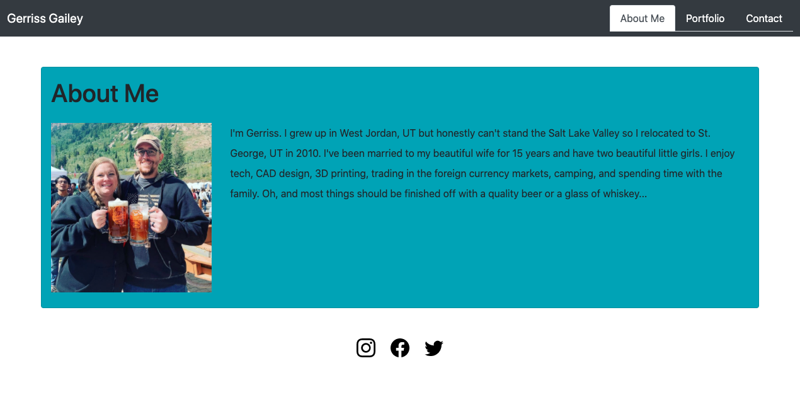

# Bootstrap Responsive Portfolio

This is a personal bio/portfolio project with a focus on creating the web app to have a responsive design through the means of using Bootstrap. The intent is that the web app would adjust to properly display the web pages whether loaded on a full computer screen or a small mobile browser on a smartphone. 

---

## Build Status

This is the initial outline for this portfolio web app. Further updates to come as my web development portfolio grows.

## Site Preview

---

## Resources

Further information about Bootstrap and it's functionality can be found at https://getbootstrap.com/.